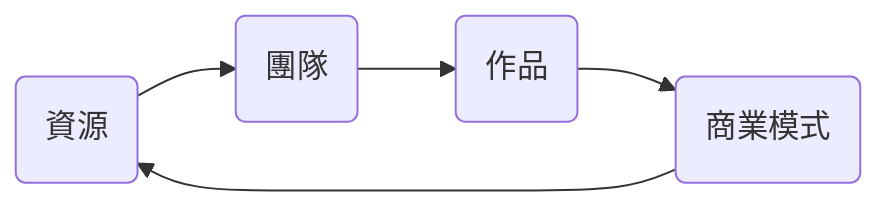
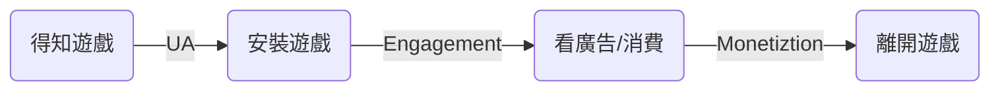
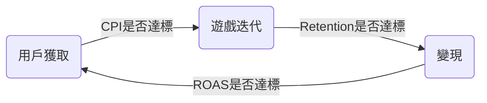
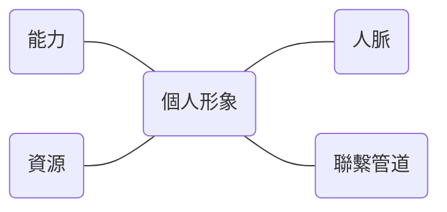
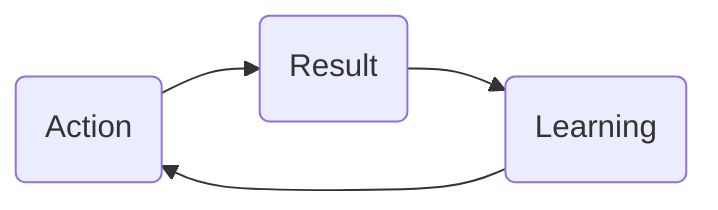

我在台大資工的系選修課 -- 遊戲設計 Game Programming的修課紀錄。

## 遊戲本體

遊戲名稱是Time Factory，目前已經放在[itch.io](https://icya.itch.io/time-factory)上作為免費遊戲。

榮獲[112 臺灣大專院校創意遊戲設計競賽](https://igd.gamelab.com.tw/)最佳創意獎佳作。

## 修課反思

### 計畫很重要

我們暑假就開始討論要做什麼類型的遊戲，當時決定了幾個選項，結果到開學還是沒能確定。直到第二次上課前才決定要做跟時間暫停有關的跑酷解謎遊戲(關於主題和創意這一點，網路上應該有非常多資源，例如可以去看看別人的Game Jam在做什麼)。

製作過程中我們也常常遇到很多源自於沒有計畫好的問題。例如：主角要不要能攻擊？要有小怪嗎？時間能量可以自動回復嗎？要有回復道具嗎？

這些都是在過程中才慢慢想好的，有些甚至到最後也沒能完全決定好，只是暫時先選一個方案來做。

我覺得如果當初能夠先把整個遊戲定性好，計畫好，一切都會更有效率。

除此之外，工作的分配也是問題。因為我們四個都是資工系，所以或多或少都有寫程式，雖然大部分(也許有接近一半？反正我沒算到底寫多少)的Script都是我寫的。

但實際上一個小體量的遊戲應該是不需要4個人寫程式的，還有同樣重要的Level Design、特效、聲音等等。

我們的素材大部分是來自[itch.io](https://itch.io/)，少部分是我和文乂畫的，然後聲音和特效是完全交給9mao負責。

但Level Design和製作基本上是我們誰想到什麼就加上什麼(但主要還是Slimlix和文乂做的)，沒有統一的規劃。

工作分配和計畫不周全導致有時候會有人(例如我)不知道該做什麼，這真的是滿大的問題。

### 合作與溝通

我們合作的方法是用[git](https://git-scm.com/)和[GitHub](https://github.com/)，除了master之外每個人一個branch，在自己的branch上做事然後再Merge到master上。

一個系統(e.g. Dialogue System, Player Control)的Script最好交給一個人做就好，可以減少看別人Code的時間，然後再把不同的系統組合起來(每個系統都要做一些Public Function和Getter作為API)。

你注意到的細節，別人不一定會注意到，所以注意到就直接說出來，不要以為別人一定會知道。

例如說發現別人的檔名有typo，不是不能改，但要先溝通好，大家都Merge之後再改。或者是別人做了關卡之後你覺得某些Tile沒放好，你就去改它，但不如直接告訴那個人，並且問問他的想法看是真的放錯還是故意的，否則他下次做關卡時還是可能會做一樣的事。

另外，我們覺得以後合作可能需要一個人負責Pull Request，管理所有的Commit會更好。不過也不一定，因為Unity的Scene(`.unity`)檔案每次Merge的時候如果Conflit根本看不出來Conflit的到底是什麼地方(所以每個Scene同時只能有一個人動)。

### 先求有再求好

老師一開始就說，先把你們的遊戲做到可玩，不要一開始就做太多花裡胡哨的功能或畫面，專精於你遊戲的特色，把核心循環做出來，把那5分鐘(或你預計的最重要的遊戲部分的時長)做到完美。關於這些，網路上有很多文章可以參考，例如[遊戲企劃必修課-如何設計遊戲的核心循環](https://medium.com/that-game-designer/%E9%81%8A%E6%88%B2%E4%BC%81%E5%8A%83%E5%BF%85%E4%BF%AE%E8%AA%B2-%E5%A6%82%E4%BD%95%E8%A8%AD%E8%A8%88%E9%81%8A%E6%88%B2%E7%9A%84-%E6%A0%B8%E5%BF%83%E5%BE%AA%E7%92%B0-8dad19cb0f91)。

舉例來說如果你的遊戲是一個單純的跑酷遊戲，理所當然地，角色操控的手感就非常重要，這是你的核心玩法。

其次是演出，所謂的美術、音樂、特效和遊戲畫面，其實都只是對於遊戲內核的精美包裝。最後才是那些其它的裝飾(例如VFX和SFX之類的)或功能(例如按鍵設定、存檔功能)。

這堂課第一次的報告是講述你的遊戲計畫，說明你遊戲的重點，什麼類型？遊戲時長？特色是什麼？不需要講大家都懂的東西，例如你要怎麼做背包系統，除非你的背包系統和市面上的有很大的不同。

第二次報告就是做出一個遊戲的Prototype，也就是原型，原型不需要美術，你完全可以用方形、圓形的圖片表示遊戲中的物件和元素，但是重點是要能讓別人分清楚什麼圖案/顏色是什麼東西，以及你遊戲要怎麼玩，賣點是什麼？據說業界很多投資商都會依據原型判斷你的遊戲有沒有~~前~~錢途。或者說，如果你的原型不好玩，就算把它再做得更複雜，加上再多元素，大概也不會好玩。

接下來就是第一次Playtest，然後逐漸把你的遊戲做完整，這堂課總共有3次Playtest以及最後的期末展演。我們這組還有參加[112 臺灣大專院校創意遊戲設計競賽](https://igd.gamelab.com.tw/)，最後拿到最佳創意獎的佳作(除了年度風雲獎和數碼未來之星獎以外，所有獎都只有一個優等和一個佳作)。很感謝李根逸教授的指導。

順道一提，最佳創意獎的優等真的很有創意，令我自嘆弗如，他們的遊戲是：玩家每次輪迴的動作(按鍵操控)會被記錄下來，之後的輪迴就會有數個影子做你之前輪迴的事情，你輪迴幾次就會同時有幾個影子，每個影子做你在對應的輪迴做的事，並且每一關有一個輪迴次數上限。

這樣說可能有點抽象，具體的例子例如說，某一關的出口很高，解法是需要用一個輪迴跑到箱子底下，然後下一個輪迴把箱子推到上個輪迴的影子頭上，最後站到箱子上達到出口。

#### Play Test

修了這一門課，我才知道Playtest有多有用，我自己的感覺是，人數越多越好，越符合目標客群越好，也可以向專業人士詢問意見。

所謂的遊玩測試就是為了避免閉門造車，向大家蒐集意見，改進你的遊戲。

不過其實比起在學校做的Playtest，還是在最後1/6在比賽賽場上，大家以及評審來玩我們遊戲時給的意見更多更有用。

評審說了很多問題，例如說顏色的意義不明確，時間能量不能回復會造成難度有一個Cliff，沒辦法適合大部分人，以及我們的遊戲最後的Boss戰打破了之前的規則(Boss不能被時停)，玩家也沒用到什麼遊玩過程學會的技能等。

不過最後一點還是我們遊戲關卡太少的原因，教授說我們遊戲現在太跳沒關係，至少先有幾個節點，之後再慢慢把中間的補齊，讓遊戲曲線更平滑(不過以後大概也不會繼續做這個遊戲了)。

#### 善用已有的資源

如果你以前就有做過遊戲，可以把之前的程式拿來用，可以節省不少時間，例如說我們的Dialougue System就是9mao把以前他做的版本搬過來，然後再稍作修改而已。當然，這需要你平常在寫Code的時候就要注意把程式寫得容易復用才行。

除此之外，美術和音樂等如果時間或資金不夠的話，適當的選擇用免費素材也沒有問題，畢竟我們的定位本來就偏向免費遊戲。

然後Unity也有提供很多資源/功能，只是資源太多有時候反而不知道而已，如果想實現什麼複雜的功能，可以先了解你用的遊戲引擎或者是網路上有沒有相關資源。

#### 堅持

這可能是要做好遊戲最重要的一點，想做遊戲的人通常是腦袋裡會常常冒出新點子的人，像我自己就是。

一開始做遊戲的時候，會很興奮，很有熱情，直到遊戲做到一定完整度時達到巔峰，但當你開始做一些重複或者比較枯燥的工作時，例如做關卡，熱情就會慢慢減退，而且腦袋裡又會冒出新的遊戲想法，導致很想去做新遊戲。但是，這正是需要堅持的時候，如果你去做新遊戲，就半途而廢了，這樣是永遠也做不完一個遊戲的。

## 遊戲技術

遊戲技術有很多，要想好需不需要，以及要不要用。當然，就算不了解技術細節其實也不太影響做遊戲，但是至少要知道怎麼使用這些技術。

這裡主要是紀錄大致有哪些技術或領域，畢竟現在網路上的資源很多，但有時候不是查不到，是不知道要查什麼。

> 警告：由於我上課通常都在做我們的遊戲，所以沒有很專心聽，[遊戲技術](#遊戲技術)和[遊戲開發](#遊戲開發)這兩個章節的內容有部分參考簡報，再加上我自己的理解(但有些例如發布和營運我也不太懂的就沒有多寫什麼)，不保證完全正確。
{: .prompt-warning }

### Game Engine

市面上有很多很多遊戲引擎，最有名的應該是[Unity](https://unity.com/)、[Unreal](https://www.unrealengine.com/)和[Godot](https://godotengine.org/)，有時候不一定要用最厲害的，應該選最適合的。

這個最適合可能有很多評判標準，例如：如果你做的是一個簡單的RPG小遊戲，[RPG Maker](https://www.rpgmakerweb.com/)可能會比Unity更適合你。不過我們選擇Unity的原因是因為我們4個人都有用Unity的經驗，可以省去學習的時間成本。

### Scheduler

現在的遊戲引擎大多都支援Multitasking，不過我們自己是用Single的線程，也就是同一時間只有一個人在做事。

不管是Multi還是Single，[遊戲中每個函式的執行順序](https://docs.unity3d.com/Manual/ExecutionOrder.html)你最好都要弄清楚，並且確定那是你要的順序。這非常重要，否則可能會發生很多bug。

例如我們遊戲角色的死亡重生的函式就遇到過這種問題，因為我們是用Unity中的Coroutine去寫它，但卻沒弄清楚Coroutine中的yield return不同的東西之後會等到什麼時候才繼續執行，是在Update之前？Update和LateUpdate之間？畫面渲染之前還是之後？等等。

### Game Control

遊戲要在什麼平台上玩，手機還是電腦？要用滑鼠鍵盤還是搖桿操控？這些都是要先想好的問題。

以及要怎麼實作？像Unity的Input System就有分舊版和新版，總要選擇一個來用。我是在它提供的API之上用一個class來管理Input，其他class只要從那個class取得需要的Input資訊即可。

另外，要怎麼做狀態之間的轉換也需要考量，哪些事情要用Event觸發？要用Finite State Machine還是Behavior Tree還是其他的什麼？我們大部分是用簡單的Finite State Machine和Event來做，包括Unity原生的Animation Controller也是有限狀態機。

### Rendering

這部分的技術比較偏向電腦圖學，不過做遊戲還是需要選擇要用哪一種[Rende Pipeline](https://docs.unity3d.com/Manual/render-pipelines.html)？怎麼Render？要用什麼風格？當然還要了解你用的引擎支援什麼。

以Unity遊戲來說，最基礎的就是要選擇用URP，HDRP，Custom SRP還是原生的Rendering Pipeline。

所謂的SRP就是Scriptable Render Pipeline，所以URP和HDRP都是SRP的一種。

然後可能還要選擇Global Illumination mode和Tile/Cluster Rendering等。

#### 風格

遊戲風格請務必要統一，這會影響到遊戲的整體觀感，尤其是如果你使用別人的素材，千萬不要用風格相差太大的。

如果是3D遊戲的話，風格大致可以分為Photorealistic和Non-Photorealistic，其中Photorealistic又分為Image-based和Physic-based Rendering兩種。甚至現在很多動畫其實都會配合遊戲引擎來做，畫師只負責最重要的部分(例如臉)。

#### Rendering Order

Rendering Order，也就是要怎麼決定每個物件誰在前誰在後，例如最簡單算法的就是[Painter Algorithm](https://en.wikipedia.org/wiki/Painter%27s_algorithm)(就是先畫遠的再畫近的，當然這個演算法也有一些做不到的事情，例如遇到[cyclical overlapping](https://en.wikipedia.org/wiki/Painter%27s_algorithm#Cyclical_overlapping)時就無法判斷遠近，所以要切分成不同塊才行)。

Unity中判斷Sprite的遮蔽關係有個依據，優先級在[Unity Doc: 2D Sorting](https://docs.unity3d.com/Manual/2DSorting.html)裡有寫。

#### 坐標系

要了解你用的遊戲引擎是使用哪一種坐標系(例如是左手還是右手座標系？)，才知道要怎麼做坐標系轉換，因為建模軟體的坐標系可能和引擎的坐標系不同。還有你的遊戲中坐標系跟螢幕位置的對應關係，Camera要怎麼設定等等，都要去了解。

如果你做的是比較特別視角和座標的遊戲，例如：Isometric、Hexagonal，也要注意Script中和畫面上座標的轉換。

#### Ray-Tracing

Ray-tracing通常是用在光影系統，光要怎麼反射、散射？要做幾次反射？打到不同的材質上要有什麼不同？Global的光源要是什麼樣？這是一門很大的學問，我自己也不甚了解，所以就不多說了。

### Camera

Camera是遊戲演出非常重要的組成部分，甚至會影響到角色操控的手感。什麼時候要讓Camera移動、放大縮小、切換等等都需要考量。[Unity的Cinemachine](https://unity.com/unity/features/editor/art-and-design/cinemachine)就是一個很好用的工具。

例如有些遊戲Boss戰前可能會有一段演出，這時候角色是不能操控的，就可以在畫面周圍加上黑色邊框，讓玩家感覺到這是在觀看演出，不是該操控角色的時間。

3D遊戲的Camera又會更複雜，因為可能會有很多死角，這些死角都要額外手動設定一個Camera，才能做到最好的遊戲畫面的體驗。

### Game Physic

要不要使用[遊戲引擎裡的物理系統](https://docs.unity3d.com/Manual/PhysicsSection.html)？還是要自己寫？這都是選擇。

遊戲的物理通常不會跟現實一樣，例如很多遊戲的[Jump](https://youtu.be/hG9SzQxaCm8?si=UHbEeed391JXwZjk)，上升和下落的速度會不同，就是為了提升操控手感，一切的物理基本上都是為遊戲體驗服務。

同時，如果你要用遊戲引擎裡的物理系統，也要了解具體怎麼用，例如Unity的物理相關函式最好都要在FixedUpdate裡調用，還有它的Layer和Collider、Rigidbody的選擇等，好像很多遊戲的主角都會用Kinematic作為Rigidbody的模式，主角跟所有物件的互動都由自己來寫。

舉例來說，碰撞時要發生什麼？速度太快穿透怎麼辦？這些都是可以思考的問題。

### Game AI

遊戲的AI跟一般的AI例如Alpha Go、[Chat GPT](https://chat.openai.com/)不一樣，遊戲AI是為了遊戲體驗服務的，但像Alpha Go只會破壞你的遊戲(下棋)體驗，顯然不能算是合格的遊戲AI。

遊戲AI有很多演算法，例如State Machine、Behavior Tree，還有些像Path finding(例如[A\*](https://en.wikipedia.org/wiki/A*_search_algorithm)、RTS用的Flow Field還有Unity內建的Navigator等)這樣有特定用途的算法等等。

不過這些還是要有具體的例子才能決定，像上面說的，我們的遊戲AI是用簡單的狀態機做的。

### Procedural Generation

自動化/程序生成技術雖然老師上課好像只有講動畫的部分，不過我還是覺得補充一下比較好。

這種技術可以生成遊戲的Map/Terrain/Dungeon/Level/Maze等，提升遊戲的隨機性和可重複遊玩性。有名的例子有[Minecraft](https://www.minecraft.net/)的地圖生成，還有大量的rougelike遊戲也都會用到，例如[The Binding of Isaac](https://store.steampowered.com/app/113200/The_Binding_of_Isaac/)和[Slay the Spire](https://store.steampowered.com/app/646570/Slay_the_Spire/)，當然，還有Rouge這個Rougelike遊戲的始祖。

除了地圖之外，Procedural Generation也可以用在動畫上，創作者只要做好關鍵幀，剩下中間的其他幀就由程式來生成，可以節省很多工作量。

另外，包括自動產生Dialogue、Model、Object和Loot的生成等，比較特別的還有任務的生成和技能樹的生成(就是生出那個圖)之類的，只要是透過程式產生而不是事先做好的，其實都可以算是Procedural Generation的一種。

具體的演算法非常多種(你也可以把它們組合起來用)，例如：

- Drunkard's Walk (又叫Random Walk)
- [Binary Space Partition](https://en.wikipedia.org/wiki/Binary_space_partitioning) (例如NetHack)
- Wave Function Collapse
- Cellular Automata
- Diffusion Limited Aggregation
- [Perlin Noise](https://en.wikipedia.org/wiki/Perlin_noise) (例如Minecraft) & [Slimplex Noise](https://en.wikipedia.org/wiki/Simplex_noise)
- Voronoi Diagram & [Delaunay Triangulation](https://en.wikipedia.org/wiki/Delaunay_triangulation)
- Force Graph
- Dijkstra Map
- [Graph Rewriting](https://en.wikipedia.org/wiki/Graph_rewriting)(又叫Graph Grammer)
- [Maze Generation Algorithms](https://en.wikipedia.org/wiki/Maze_generation_algorithm)
- 還有更多......

網路上也有很多介紹，例如[Herbert Wolverson - Procedural Map Generation Techniques](https://www.youtube.com/watch?v=TlLIOgWYVpI&ab_channel=RoguelikeCelebration)。

還有一些可以幫助程序生成的演算法例如Steering Algorithms和可以讓你生成的東西更加平滑的[Marching Cubes](https://en.wikipedia.org/wiki/Marching_cubes)(2D版叫[Marching Square](https://en.wikipedia.org/wiki/Marching_squares))，以及大量的圖論演算法例如找[Minimum Spanning Tree](https://en.wikipedia.org/wiki/Minimum_spanning_tree)的演算法。

### Visual Effect

Visual Effect包括很多，跟Rendering也有重疊的部分。

例如說，各種Anti-aliasing技術的選擇。像我們因為做的是像素風格的遊戲，所以是完全不用anti-aliasing的。

還有遊戲景深、Post-Processing、Particle System等等。例如我們遊戲的時停效果是模仿JoJo裡的ザ・ワールド(za warudo)，做成類似反色調的世界一樣，這就是用Shader加上Post-Processing完成的。

### Sound Effect

一個完整的遊戲，是要有音樂和各種音效，才能夠提高玩家的沉浸感。而這些就會用到Sound Effect。

例如，當你在播放音效時，背景音樂要怎麼辦？，常見的做法是用Ducking，讓背景音樂的音量在放音效時降低，以凸顯音效。

在Unity中，有[內建的Audio Mixer](https://docs.unity3d.com/Manual/AudioMixer.html)可以做到混和音效和加上各種Sound Effect，例如剛才說的Duck，還有Low Pass、High Pass、Echo、Distortion等。

### Network

為什麼一個遊戲需要Network？大致可以分為4種原因：
1. Multiplayer
2. Save/Load & Vertify
3. Social
4. Other

並且只要用到Network，就都要解決一些問題，例如資料傳輸格式和加密等等，這些都是要好好考量的事情。

#### Multiplayer

這沒什麼好說的，現代的多人遊戲通常都需要網路，除非你可以讓2個玩家在同一個電腦上一起玩(例如分別使用左右邊的鍵盤)。

如果要做連線多人遊戲的話，首先要解決的問題就是幀同步(Frame Synchronization)。如果想了解的話可以查Lockstep Protocol、Bucket Synchronization等等。

除了幀同步以外，還有狀態同步、Asynchronous function call怎麼辦之類的問題

基本上要考慮的問題包括但不限於：每個人要看到一樣的東西(例如Random結果要一致、Floating Point精確度問題等)、如果有人的電腦跑得特別慢怎麼處理、Server要做Simulation再傳給Clients還是只做Authority？要做Client-side Prediction(先對下一幀發生的事做預測)嗎？

#### Save/Load & Vertify

Save/Load說實話，其實不一定要用到網路，只不過現在的遊戲為了更好的保存玩家的遊戲紀錄(也可能是增加玩家刪檔或棄遊的成本？)，通常會用到網路。有些遊戲為了增加沉浸感，就讓一個帳號只能有一個存檔(或者說現在的手遊大概都是這樣)。

而Vertify有很多種，舉例來說，帳號密碼的確認和每日登錄要確定時間是否正確就需要網路。

#### Social

社交當然也需要網路，如果你想在遊戲裡加上排行榜、加好友、聊天等功能，就會用上。

### Performance Optimization

需要考慮的東西大致上有：
1. Memory Usage
2. CPU Usage
3. GPU Usage
4. Network Usage
5. Power Usage

然後Unity有一個功能叫做[Profiler](https://docs.unity3d.com/Manual/Profiler.html)，可以看你遊戲執行的時候實際花了多少資源，如果是做遊戲的新手，最常遇到的問題就是GC用太多Memory，或者是Script太沒效率(以60 FPS來說，1秒60幀代表一幀的運算要在16ms內完成才不會卡頓)。

以下列出一些主要可以改善的地方。

#### Memory Usage

##### Texture format

例如少用Alpha Channel，渲染透明的東西其實很花資源。

##### Texture compression

首先圖片大小最好是2的倍數，甚至有些引擎或目標平台例如手機可能會限制你只能用什麼樣大小/比例的圖片。

##### Mipmap

舉例來說，同張圖片在不同距離/大小下應該看起來是怎麼樣的？

Mipmap就是不同距離/大小下同張圖片看起來的樣子。

##### Audio compression

音樂通常檔案很大，但其實大部分遊戲都不需要那麼高的音質，壓縮後一般人也聽不出差別。

#### CPU Usage

##### Garbage Collection

例如[C#的GC](https://learn.microsoft.com/dotnet/standard/garbage-collection/)會自動幫你把Memory free掉，減少GC次數的方法就是減少allocate memory的次數，例如少用new關鍵字(如果new的是struct就沒差，例如Vector3)。

##### Object Pooling

物件池，也就是先預生成會用到的數量的物件，然後要用時從物件池拿，用完再放回去，不要一直生成和刪除物件。

#### GPU Usage

##### Number of draw calls

減少渲染次數。例如同樣顏色的Button，Unity其實會分2次渲染。解決方法是使用[Sprite Packer(Atlas)](https://docs.unity3d.com/Manual/SpritePacker.html)，將Texture合併，如果用的是同樣的Material和Shader，Unity就可以在一次Draw call裡渲染多個物件。

而且Unity的UGUI是以Canvas為單位渲染的，只要Canvas裡有東西動了，就會整個Canvas重畫一遍。例如如果你在聊天室軟體中加上了動態的表情符號，所耗的效能可能就會大大上升。適度的切割Canvasc或使用Canvas Group會更好。

然後不會動的東西可以勾選static，這樣Unity就可以做precomputation，提升效能。

另外，建模的Vertices/Faces數量也需要和效能做權衡，Mesh的點/面數越多雖然看起來會越逼真，但也要花越多效能。

##### Fill rate

Fill rate指的是GPU渲染的效率，例如pixel fill rate就是GPU每秒可以畫多少像素。

而要降低每秒畫的像素量，就是只畫必要的畫面，例如可以做Culling，畫面以外的物件就不要渲染，被擋住的物件也不需要渲染。

## 遊戲開發

### 遊戲開發規模

1. 3A(AAA)：通常要數億成本，達到400人以上，定價新台幣1600元以上。
2. 2A(AA)；約50~100人的規模，定價在新台幣800~1600元左右
3. 獨立遊戲(Indie Game)：通常20人以下，甚至單人開發，定價多在新台幣800元以下。

> 以小團隊的獨立遊戲來說，一年的開發期可能要賣上萬套才有機會打平。

### 遊戲開發流程

常見的遊戲開發流程是：

1. 前期製作 (pre-production)
2. 量產 (production)
3. 發布 (launch)
4. 營運 (operation)

### 前期製作

前期製作的目標是培養團隊的共同認知：

1. 目標客群 (target audience)
2. 世界觀 (world bulding)
3. 劇本大綱
4. 尺規 (metrics)
5. 協作方式等等

#### 決定目標客群 Target Audience

1. 發布平台 (publishing platform)
2. 遊戲類型 (game type)
3. 營運模式 (business model)
4. 文化/地域 (culture/region)
5. 美術風格 (art style)

##### Platform

選擇你的遊戲要在什麼平台上玩，當然也可以選多平台，但多平台要做的事情會有很多，例如OS如果跟你的遊戲不太相容，也許要重寫另一個版本的遊戲，再來就是Input要用什麼，多平台的遊戲就要做到支持不同方式的Input：鍵鼠、觸控、搖桿等等。

螢幕的Resolution也是一個很麻煩的問題，要調整你的UI讓他可以符合所有的平台(其實很難)，或對不同平台做不同的UI。

除此之外，還有Performance、Testing、Porting等問題要解決，我真的很佩服做多平台的人(光做一個平台就能磨滅我的熱情了XD)。

##### 遊戲類型

1. 箱庭 (sandbox)
2. 即時戰略 (RTS)
3. 射擊 (shooters)
4. 多人線上戰鬥競技場 (MOBA)
5. 角色扮演 RPG
6. 模擬 (simulation)
7. 運動 (sports)
8. 解謎 (puzzlers)
9. 策略 (strategy)
10. 派對 (party games)
11. 動作冒險 (action-adventure)
12. 生存 (survival)
13. 恐怖 (horror)
14. 平台 (platformer)
15. 博弈 (game of chance)
16. 成人 (18+)
17. 還有更多...

##### 營運模式

1. 買斷
2. 買斷+資料片(DLC)
3. 免費(F2P)+廣告(in-app advertizing)
4. 免費(F2P)+內購(in-app purchases)：永久性商品或消耗型商品
5. 訂閱(subscription)：月卡制、點數卡

##### 美術風格

1. 概念美術(Concept Art)：Midjourney？
2. 直接進入市場：直接發廣告試試看回饋？

#### 前期製作的驗證手段

1. 建立原型 (prototyping)
   
   最前面的章節我有提到，不過其實也不一定要真的做出一個遊戲，可以用Storyboard、Colorkey、Greybox，Previz之類或者拿剪紙來演示也可以，重點是要能動起來，並讓別人知道你的遊戲在幹嘛。

2. 建立垂直切片 (vertical slice)
3. 遊玩測試 (playtest)

### 發布

遊戲做到最後，就可以選擇要不要發布了，像我們只是放在[itch.io](https://icya.itch.io/time-factory)上作為免費遊戲。但如果你想要給你的遊戲一個更加轟轟烈烈的結尾，就可以考慮以下的事情。

1. Marketing & Public relationship
2. User Acquition
3. Launch
4. Hotfix
5. Analytics

#### 最小化風險

- 不好玩？做體驗評估 (experience evaluation)。
- 賣不好？做市場分析 (market analysis)
- 做不完？做專案管理 (project management)

#### Publishing Issue

1. 身分：個人/公司 (還有稅務問題)
2. 管道：自行申請/透過發行商
3. 費用：抽成與持續上架費用
4. 語言：Multi-lingual？
5. Marketing/Public Relationship
6. Vedio Game Rating System： [每個國家的分級制度不同](https://zh.wikipedia.org/zh-tw/%E9%9B%BB%E5%AD%90%E9%81%8A%E6%88%B2%E5%88%86%E7%B4%9A%E5%88%B6%E5%BA%A6)
7. Personal Data Protection (個資保護)：GDPR[EU]、PIPL[CN]、App Tracking Transparency？

#### Publisher

發行商/代理商可以做的事情有很多，包括提供經費、宣傳行銷、協助開發(例如人才媒合、本土化、測試、平台移植)，周邊商品等，同時發行商和平台的關係通常也會比個人好，有助於審核或者是有獨佔合約之類的。

#### Publishing Platform

要在哪個平台上發布？

現在主流的PC遊戲平台包括[Steam](https://store.steampowered.com/)、[GOG](https://www.gog.com/)、[itch.io](https://itch.io/)、Microsoft Store ([XBox PC](https://www.xbox.com/))、[Epic](https://store.epicgames.com/)、WeGame等。

主機(Console)的遊戲平台則有[PlayStation Store](https://store.playstation.com/)、Microsoft Store ([XBox](https://www.xbox.com/))、[Nintendo Store](https://www.nintendo.com/us/store/)等。

Mobile的遊戲平台則主要是[App Store](https://www.apple.com/tw/app-store/)和[Google Play](https://play.google.com/store/)還有Tap Tap，其中App Store會有iPhone/iPad/tvOS/macOS的不同以及版本問題要解決，還有設計要求；但Android的問題也不小，具體可以參考[[2019 TGDF] Unity 手機遊戲開發防火指南 (趙峻甫)](https://youtu.be/kdnm_osNZ9s?si=PdC70cdhKmtbIsMM)。但如果手機遊戲經營得好的話，只要能上App Store和Google Play首頁或排行榜，就等於是他在免費幫你打幾百幾千萬的廣告。

另外如果你想要發佈到中國的話，也會有版號、防沉迷規定、以及渠道太多太混亂的問題。

至於街機(Arcade)，說實話我完全不了解XD。

總而言之不管要發佈到哪個平台，最好都要事先了解相關的規定和優缺點。

### 營運

#### 營運要面臨的挑戰

- Monetization：要怎麼實現賺錢？In-app advertizing？
- Cheating：公平性如何實現？
- Community：遊戲社群如何經營？

#### 營運數據分析 Analytics

- New player
- Revenue
- Copied
- Realtime Data Processing System。

##### Telemetry Report

- Retantion, D1, D7, D30
- DAU, MAU
- ARPU, ARPPU, ARPDAU
- K-factor
- New User Acquition：Propensity modeling

最後同樣，要善用已有的資源，例如[Unity Game Services](https://unity.com/solutions/gaming-services)有提供Analytics、Diagnotics, User Reporting, Unity Ads等等。

## 商務開發

這門課有一次，老師邀請了[玩猴遊戲](https://macaca.games/)創辦人[Rocky Hong](https://www.rockyhong.com/)來演講。演講的主題是「遊戲、企劃、美術 總被遺忘的的是商務」。

講者一開始就跟我們說他失敗的經歷，在他開始做遊戲的時候，運氣很好，做好遊戲直接上架結果病毒式傳播，賺了很多錢，卻因此以為遊戲只要做得好就能賣。結果後來做的遊戲就直接把公司前三年賺的錢全賠光了，詳情參考[天空盜賊團驗屍報告](https://youtu.be/DFRnz0xl6lI?si=VhJeMFTxUVf6FTlw)。

> 只有一個夢 +
沒有商務思維 +
堅持到底(all in再all in，沒有好的停損機制，過度樂觀) +
陌生的團隊成員 +
陌生的管理 +
陌生的玩法 +
陌生的系統設計 +
陌生的規模 +
陌生的開發流程 +
陌生的變現方式 +
陌生的市場 +
陌生的數據分析 +
陌生的廣告投放
= **雪崩式開發**

> 我知道在文章中放太多引用不太好，但是講者講的實在很~~好笑~~有趣，我忍不住把它分享給你們的慾望。
{: .prompt-info }

### 商務開發

你以為的遊戲開發流程：

> 你有一個偉大的願景
> 
> 還有一個熱血的團隊
> 
> 然後認真把作品做出來上架
>
> *相信只要作品好，遊戲自然會成功*

那麼問題來了，沒有資源如何開發遊戲？沒有商業模式如何營利繼續產生資源？

講者的簡報中有一張圖，上面畫的就是「資源」➜「團隊」➜「作品」➜「商業模式」➜「資源」的循環圖。

遊戲開發流程中，只有「團隊」➜「作品」這一部分，而資源和商業模式就是商業開發的範疇。

也就是講者所說的：

> 對我而言，商務開發是建立**「願景」**，**「運行」**與**「經營」**之間的脈絡與循環。
> 
> 並讓這個循環得以：**永續**、**成長/拓展**

### 商務模式

你以為的商務模式：

> 你上架了一個作品
>
> 並設計了變現的方式
>
> *相信只要作品好，玩家自然會買單*
>
> **修但幾勒，你哪來的玩家**

商務模式包含的內容有很多，例如：

- 具體變現的策略是什麼？
- 玩家的參與度如何？
- 付錢的人是誰？
- 玩家從哪裡來？
- 賺多少才能突破開發與營運成本？
- 可以持續嗎？

講者的一句話總結：

> 對我而言，商業模式是一個能夠 **具體** 落實的一個 **持續** **營利** 的 **系統策略**

#### 玩家歷程

這4個部分，得知遊戲到安裝遊戲的階段叫做UA(User Acquition)，用戶獲取，量化指標是行銷成本和人均安裝成本(CPI，Cost Per Install)；安裝遊戲到看廣告/消費的階段叫做互動(Engagement)；看廣告/消費到離開遊戲的階段就是變現(Monetiztion)，量化指標就是營收和人均終身價值(LTV，Lifetime Value)。

$$ \frac{人均終身價值 LTV}{人均安裝成本 CPI} = 行銷投報率(\%)ROAS $$

所謂行銷投報率 ROAS (Return on Ad Spend)，就是你花多少錢在行銷上，可以獲得多少回報。

但是很顯然，每一個階段都會損失很多玩家，有很大一部份連得知都做不到，就算得知也不一定會想玩，玩了也不一定會消費，直到最後離開。所以，通常及時停損是比堅持到底更明智的選擇。

#### 停損與風險控制

> 透過量化指標、策略與檢核點，可以及早停損或檢驗商業模式的可行性。

例如在「用戶獲取」➜「遊戲迭代」➜「變現」➜「用戶獲取」的模式中，有三個檢核點：CPI、Retention和ROAS。

#### 商業模式可以很創新

講者有舉一個例子：在超休閒遊戲的商業模式中，使用者才是商品。

簡單來說，因為超休閒遊戲容易吸引大量玩家，所以玩家就是其用來吸引廣告商的手段，因為玩家的數據對廣告商來說很有價值。且玩家看到超休閒遊戲裡的廣告也有可能又去玩廣告對應的遊戲或消費對應商品，說不定還能再賺一筆。

#### 商業模式可以很多元

以Business和Customer的關係來劃分的話，可以分為B2B、B2C、C2B、C2C四種商業模式。

B2C就是面向使用者的商品/服務等，B2B可能是和其他公司的合作/授權/代理或同樣是商品/服務等。

C2C以例子來說有各種拍賣網站，讓消費者之間可以互相交易，或者是向Uber之類的共享經濟。

C2B舉例來說，接案就是一種，消費者以自身專業技能向企業提供服務。

除此之外，還有很多種其他商業模式，例如目標是政府單位的獎金或標案之類的，也有混和型商業模式，例如C2B2C，消費者提供商品給第三方平台，再賣給其他需要的消費者。

#### 商業模式的賽道與行銷

> 市場是裝滿石頭的瓶子，永遠都有空隙

市場永遠有空缺的地方，只是我們常常發現不了那個地方是什麼。真正的難點不是創造價值，是讓客戶看見並消費，使價值被體現出來。找到適合自己的賽道才是真正的課題。

### 資源

就算商業模式再怎麼合理，放到市場上執行的時候也有可能會失敗，因為市場是在不斷變化的，就像遊戲需要迭代測試一樣，商業模式也要迭代測試。但迭代測試歸迭代測試，賠的錢卻回不來了，所以如何獲取資源也是一門學問。

#### 資源的種類

錢：最好流通的資源。

來源有很多種，例如銀行貸款、天使／創投、政府獎金／補助、發行商、策略合作等等

但錢不是唯一的資源，還有空間、產品、流量、服務等等。而且有時候直接越過錢，去找你需要的資源的提供者會比單純花錢更好。

舉例來說，你需要雲服務，可以直接找供應商談優惠；需要流量，可以直接找廣告商/新聞媒體/Influencer等；需要設備，可以找廠商進行策略合作租借；需要空間，可以找已有空間的單位談合約。這些都是比單純用錢去求/買更好的做法。

### 商務條件

商務條件，指的就是具體明確的What、How、Why。

以合作來說，合作的商務條件就包括你的需求、你能提供的資源/服務，你要怎麼和別人合作(例如合作方案、交付方式、退場條件、補償方式等)，以及別人**為什麼要和你合作**(例如對方和你在產業中的關係、團隊過去實績、產品數據等)。

### 個人商務

#### 為什麼要開發個人商務？

人，是商業系統中的重要節點，做好個人商務，更有可能實現你的願景。

#### 什麼是個人商務？

> 對我而言，個人商務是建立 **個人形象** 的 **互惠網絡**，
> 
> 促進 **能力**、**人脈** 與 **資源** 的對接，實現多方 **價值最大化**。

所謂的人脈互惠網路，就是你有需求時可以找到有能力/資源/人脈的人；別人有需求時可以也找到你，你可以幫他解決問題或找其他有能力/資源/人脈的人幫他解決問題。

#### 建立人脈網路

建立人脈網路的個人風格大致分為兩種，積極主動與積極被動。

積極主動就是主動向他人聯繫/攀談，而積極被動就像是在自己的社交帳號上發布作品/得獎紀錄之類的。

不論是哪一種，前提都是要**積極**。

##### 建立人脈網路的效率

商務交流的敘事是有方向性的，面向不同的聽眾，雖然你說的都是同樣的故事，但要有不同的敘事。

講者說，經過多年的人脈交流經驗之後，終於體悟了以下兩句格言，用來判斷交流的有效性。

1. 甘我屁事 None of My Business
2. 甘你屁事 None of Your Business

如果一件事是My Business又是Your Business，那就等於Our Business。

但如果不是，也請保持禮貌。

> 如果一段對談，
>
> 不關我的事，那麼感謝你的資訊。
>
> 不關你的事，那麼感謝你的意見。
>
> 不關我的事，也不關你的事......你也是對的，不客氣。

#### 講者的商務思維

所謂目標導向、有脈絡的，就是任何的陳述句都要有具體Why與How，也就是陳述句的目的/動機和行動/影響。

舉例來說，要參加遊戲展的動機可以是：需要發行資源、開發資金、品牌曝光，然後具體要做的事情是：鎖定媒合發行商、探詢投資管道，最後取得行銷成果。

而來學校演講的動機可能是：建立人脈網、招募人才、建立商譽，具體要做的事情是：分享聯絡資訊、提供招募訊息、分享公司主張。

凡是行動就會有結果，但不論成功與失敗，都只是你人生中的一個時間點，把經驗化作成長的養料，不斷的行動，才能不斷的成長。

最後，他有提到一些其他的部分。

1. 不要怕丟臉：錯一次，你會記住這個教訓一輩子，但其他人沒人會記得你丟臉的樣子。
2. 認識/說服對的人比認識/說服每個人更重要。
3. 說話要保持肯定，並且要有後續動作。

   舉例來說：~~我不知道。~~這部分我不清楚，我會再研究一下。

4. 不論是什麼的比賽，獎金都是死的，人脈才是你真正的財富。

## 關於遊戲行業

在1/6比賽的最後，教授有跟我們講到遊戲行業的面貌。

首先可能要先考慮這個問題：你想做自己的遊戲還是幫別人做遊戲。如果你想自己做遊戲，那麼可能要考慮創業。如果要幫別人做遊戲，又分為2種情況：做你喜歡的遊戲或不喜歡的遊戲(有些公司你可以知道他們要做什麼遊戲，或者至少知道類型，就看你的接受度)。如果你覺得可以接受，那麼就可以嘗試看看(或者就算感覺不能接受也可以嘗試？不試試怎麼知道到底可不可以接受XD)。

遊戲行業和一般產業不一樣的地方，在於它是專案導向，有新遊戲的時候就會招很多人，這時是進入遊戲行業的好機會，但在遊戲開發的過程中，通常是不太會招人的，而且這個時間可能有兩三年。也就是說，如果想進遊戲行業，一定要多關注相關消息，否則可能會面臨很久都沒有招募訊息的情況。

而營運式的遊戲又不太一樣，它們會越招越多人，像是原神，每一個角色背後肯定都有團隊在為其設計形象、技能、故事等等，想要新增一個角色，或者新增一些遊戲內容，就會多招很多人。但是同樣的，因為是專案導向，所以當營運結束的時候，常常就是大量工作者失業的時候。

以我自己來說，雖然很喜歡做遊戲，以遊戲為工作也不是不能接受，但如果可以的話，我還是希望能夠把做遊戲當作副業或閒暇興趣。
