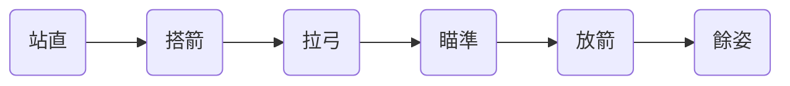

關於我在台大射箭社的初學經歷。

## 前言

為什麼會想加入射箭社？大概是我從小就很喜歡射擊類遊戲吧，不是指電子遊戲，而是像夜市擺攤的射飛鏢或套圈圈那種需要瞄準和技巧的遊戲。

大一上的時候我就有去他們(現在是我們)的迎新茶會，可惜當時還是用抽籤的辦法，我備選35沒上。

大二上就改成可以寫一篇短文(其實沒限字數)，來讓社員(可能是社長或幹部之類的)判斷你是不是適合射箭社，簡單來說，至少也要表明你加入射箭社的動機，當然我自己就是寫興趣，也有寫到從小喜歡射擊遊戲的部分，還有喜歡弓箭的結構和美感等等，我記得不知不覺就寫了500字吧？XD。

總而言之，很高興我成功入社了。

另外，我覺得射箭和其他的瞄準類運動不太一樣，至少對我來說，在射箭時比其他運動會更加專注，每次拉弓射擊都很容易進入心流，感覺時間過得超快。

> 由於學校好像只有右手弓(右手拉弦)，我自己也是右撇子，所以以下內容以右手反曲弓為準。
{: .prompt-warning }

> 警告：這篇文章只是具體的介紹社箭是什麼樣的運動，而且我也是新手，可能會有錯誤的地方。如果真的想要學社箭的話，請找教練指導，很多細節不是單靠文字就能說明白的，請勿直接按照此文章的方法自行練習。
{: .prompt-danger }

## 射箭究竟是什麼樣的運動？

我自己學/練習一個學期下來，感受到最重要的就是**「姿勢」**和**「紀錄」**。

不過據學長說，當你練箭有一段時間之後，通常都會進入一段瓶頸期，這時候**「心態」**也很重要。

### 姿勢/動作

首先動作沒得說，這是最重要的，雖然我常常也會做不好，但至少還是知道理論上要怎麼做。之所以會有射箭的標準動作，就是為了讓箭射得更穩定以及減少對身體的傷害。

姿勢做錯也沒有關係，學長姐們也不敢說自己的動作就百分百正確，大家本來就都在學習，慢慢調整就好了。

#### 站直

這應該是我自己最常犯的錯誤，很容易不自覺地挺胸。

正確的作法是，搭箭或舉弓之前，先把身體站直(雙腿不要太開，與肩同寬就差不多了)，不要往前也不要往後，尤其是不要挺胸，拉弓時雖然要用背的力支撐，但肩胛骨也不要夾起來。

#### 搭箭

搭箭的時候，把箭放在弓身的箭座上，然後箭尾扣住弓弦上的搭箭點，同時要注意箭羽的方向，如果是最基本的3羽的直羽，主羽要朝左(簡單來說就是你扣上搭箭點後，應該要有一個箭羽是水平朝左的)。

#### 拉弓

搭好箭之後，右手扣住弓弦(我們是三指扣弦，箭要在食指和中指之間)，把弓舉起來，高過手臂伸直的水平線(左手是往斜上方向)，然後往下的同時左手推弓，右手拉弓，直到左手是水平的時候完全拉開，並且右手的虎口應該會碰到下巴的右邊。

##### 握弓❌，推弓✔️

新手最常犯的錯誤就是握弓，拉開弓弦的時候，手不是握著弓身的，而是應該像是往前推一樣，用虎口和拇指下面手掌那一塊去推弓，這樣不但可以幫助把弓拉開，射擊時也可以增加射擊力度和穩度(避免射出去時手抖)。

不過，新手最一開始練習的時候沒握住弓可能會怕，這可以慢慢練習。

同時，因為弓會往前倒，所以持弓繩最好短一點，弓才不會飛出去又突然被持弓繩勒住然後嚇到自己。

##### 左右手、肩膀、背

拉弓時，左手除了推弓之外，要整個伸直，而且肩膀處不要聳起，兩個肩膀都是，如果會聳起的話，就要重新拉弓，讓肩膀往下(雖然標準的動作是不用肩膀往下的，但至少比聳起好)，要有一種卡住的感覺，類似用你的骨骼卡住手臂，背部肌肉支撐弓身往後的力量，不要用手臂的肌肉去支撐，手臂只負責對抗弓往下的重量。

右手拉弓的時候，同樣要用到背部肌肉，不是單靠手臂的力量把弓往後拉。這樣講可能不太容易理解，因為左手推、右手拉是同時的動作，類似把左右手同時展開一樣的感覺，用背去帶，但同樣注意不要讓肩夾骨往後夾，而是要有肩膀往左右張開(要有一種張力)的感覺。

運動完後可以用痠痛部位來判斷動作做的對不對，如果動作有做對的話，應該是背部會痠，如果手臂很痠的話就代表你用太多手臂力量了。

另外，右手究竟是要用指腹還是哪個指節和弓弦間接接觸(因為有指套)都是可以的，建立習慣就好。

#### 瞄準

對右手弓來說通常的做法是閉左眼，用右眼看。並且鼻子中間和嘴唇中間要碰到弦，成一直線。

然後你可能會看到弦和瞄準器的相對位置在不斷的左右晃動(類似簡諧運動？)，這時你要選擇一邊，眼睛看起來弦是對準瞄準器左側或右側(好像也有人是對準弓身的左側？)，其實都可以，但要建立習慣，每次都是對準同一個地方。

#### 放箭

弓拉滿之後，瞄準(對新手來說準度不是第一位，其實不太重要)，然後右手鬆開弦往後帶，不是往外帶。

#### 餘姿

箭射出去的時候，弓身應該會往前倒(如果有正確的推弓的話)，這也是會什麼需要持弓繩的原因，就是避免弓掉到地上。

同時，透過判斷弓身是不是垂直往前倒，也可以得知你剛才地用力方向是否有偏左或偏右，以利於下次調整。

### 紀錄

當姿勢調整得差不多之後，除了繼續慢慢調整之外，想要射得準，就要記錄。紀錄確切來說，是為了**「讓每次的動作都一樣」**。

如果你不能讓每次的動作都一樣，何談精準？或者說，提升準度的過程，就是努力讓自己的動作一致的過程，假設你有一次射中靶心，那麼如果你以後每次的動作都和那次完全一樣，在沒有風影響的時候，如果箭足夠好的話，你每次也都會射中靶心。

瞄準器的數值、位置，要逐漸找到最適合自己的點(這會隨著換磅數和距離而變)，然後記錄下來，以後就用這個來調整瞄準器，才能確保你每次瞄準的角度都一樣。

拉弓的長度同樣要保持一致，因為射擊力度會影響你箭多遠會往下掉(同樣會隨著換磅數和距離而變)，簡單的做法就是確保每次都拉滿弓，如果有夾箭片會更好。

看弦影和閉眼也是，不管你是看左邊右邊，閉左眼右眼(右手弓通常是閉左眼但也有例外)，最重要的是要選擇一個定下來，以後每次都做一樣的事情。

另外，射到箭靶上的分數也要記錄，每次練習一局[^fn1]的得分是多少(我6/18在18米射大靶一局才59分XD)，記錄下來才能看見自己的成長，自信也是一個好的射手能力的重要一環。

[^fn1]: 一局，在台大射箭社指的是每次射6支箭，然後休息(換其他人)，再射6支箭，總共射36支箭，滿分360分。

## 射箭社教學內容

除了最基本的動作和射擊練習之外，還會教一些和射箭相關的技能，例如怎麼上弦、下弦、修箭、製作陽春版指套和持弓繩、甚至下學期還會如何製弦(聽說外面製弦一條要800塊)等等。

除了反曲弓之外，還有一次我印象最深的是複合弓的體驗，之所以叫做體驗，是因為複合弓基本上都是量身打造的，如果真的要用複合弓，建議還是要買一個自己的，否則和別人共用光是調整各種弓身上的小裝備就要花很久時間。

## 器材介紹

這裡主要介紹我平常使用的練習用反曲弓，如果想要更多種類更詳細的介紹網路上應該查的到很多。

### 弓

分為弓身、上下弓臂、弓弦、瞄準器和平衡桿。

#### 弓身

弓身就是你拿弓的部位，而且還會有弓窗，也就是中間架箭的地方，弓身會往右一點，讓箭可以直直地放在那裏(我沒射箭以前還以為會是在弓身上開洞)，而不是向傳統弓一樣箭要往左或往右偏。

#### 上下弓臂

注意，反曲弓的上下弓臂是不同的，上弓臂通常較長，不過我都是看標示來判斷的。而反曲弓之所以叫做反曲弓，就是因為弓臂裝好之後，上弦之前兩個弓臂是往前彎的，而上弦之後弓臂卻是往後的(當然末端還是往前)，整體和起來就是反曲的樣子。

#### 弓弦

注意不要只拿其中一端，因為弓弦都是有轉好的，只拿一端很容易會讓弓弦轉動，然後就會鬆掉。

##### 上弦

先把弦的一端(弦同樣有分上下端)扣在下弓臂，然後把弓身往自己的方向拉，把上弓臂往外推，把弦扣到上弓臂頂端，最後調整弓弦的位置對到弓臂上的凹槽，再拉弦幾次聽聽有沒有奇怪的聲音確認是否有正確的裝好。

##### 下弦

同樣把弓身往內拉，上弓臂往外推，同時把弦的上端從上弓臂上扣下來即可。

#### 瞄準器

就是一個有可以調整準星上下左右位置，莊在弓身上弓窗往上的位置的器具。

#### 平衡桿

裝在弓身上弓窗之下的地方，用來平衡弓的重量，提升射擊穩定度。

### 箭

#### 箭頭

箭最前面那個尖尖的東西。

很危險的東西，所以前方或側前方有人時請勿射擊，別人射箭時也請待在他後方或側後方(因為你不能保證自己或他人不會射歪)。

#### 箭桿

就是中間長長的那一段，會影響到箭射擊的方向，所以如果箭桿有彎曲，最好不要用。

#### 箭羽

箭的末端，黏在箭桿上的羽片，用來保持箭的平衡及穩定度，我練習是用三片直羽，分為一片主羽和兩片副羽。不過也有學長姊是用四片捲起來的羽片，叫做螺旋羽或捲羽，會更加穩定。

#### 箭尾

我這裡指的是箭最後面，用來扣在弓弦搭箭點上的結構，我也不知道專有名詞叫什麼，就叫他箭尾了。

### 護具

#### 指套

用來保護拉弓的右手手指，避免被弓弦傷害。

#### 持弓繩

用來避免弓身在餘姿的階段落地。

#### 護臂

主要是保護左手不會被弓弦擦傷，不是每個人都需要護臂，如果會被擦傷的話，你也可以練習轉動手軸(沒錯就是轉手軸，手腕或肩膀)來讓那一塊手軸上突出的骨頭不要向內而是向下。

## 總結

其實有關查到一個現象，就是人數隨時間越來越少。一開始入社的新生有50人，分為週二和週四的兩組。我以為後面兩組合流之後人數會變多，結果竟然反而變少了，有些人也是不知不覺就沒再看到了。

我記得有人是說，她以為射箭社就是來輕鬆射箭，但是卻看到大家好像都很拚的樣子，實在承受不住壓力，我也不知道怎麼評價，就像雖然其他人很多都進步比我快，但也不需要和別人比呀，又不是以競技為目標，按照自己的步調走就好。還有人聽到這件事之後說，那是因為她沒有看到我們在後面撿箭的樣子(指完全射歪射到靶後面)。

總之不論如何，雖然目前才射箭半學期，但我真的很喜歡射箭，希望動作能調整得更好，準度也能逐漸提高。大家一起加油，共勉之！
