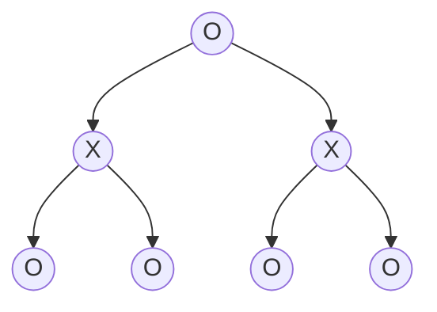
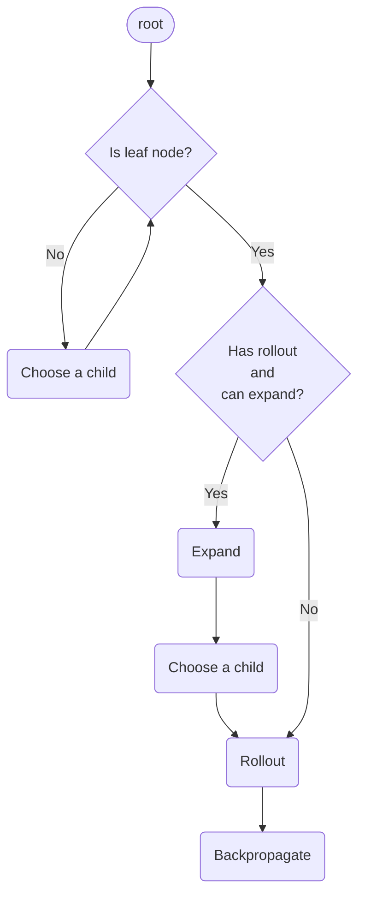

## Introduction

蒙特卡羅樹搜尋([Monte Carlo Tree Search](#monte-carlo-tree-search)，MCTS)，是一種適用於大部分perfect information遊戲的best-first搜尋演算法，因為它不需要了解遊戲的規則，只要遊戲能夠被定義為一種特定的形式，就可以適用。

因為很多遊戲，例如圍棋，第一步就有$$19\times19$$種可能，想要窮盡所有策略，大約要$$361!\approx1.4\times10^{768}$$，現階段的計算機根本是不可能在正常的遊戲時長裡算出來的。所以很多搜尋演算法的根本原理就是選擇性的放棄某些遊戲分支，不要窮盡所有可能，而MCTS也是一樣。

Monte Carlo的精隨在於：AI根據現在的局面和眾多可以做的行動，產生出眾多對應的下一局面，雙方在這些局面下「隨機」行動，直到遊戲結束/分出勝負為止，重複非常多次，計算勝率，勝率越高的局面對應的行動就越好。

而[Information Set MCTS](#information-set-mcts)是MCTS的變種，適用於imperfect information的遊戲，稍後再談。

## Game Definition

想要讓一個遊戲可以適用MCTS，首先要定義它。遊戲是由Player、State和Movement所組成的。舉例來說，圍棋的盤面和現在換誰下就是State，玩家落下一子就是Move。

MCTS有一個好處在於，它的程式碼本身不需要知道遊戲怎麼運作的，只會呼叫那些函式。只要把Player、State、Move和幾個函式寫好就可以了，不管是什麼遊戲只要能寫成這種形式基本上都能適用MCTS。

不過，圍棋太複雜了，我們還是用簡單的Tic Tac Toe來舉例。

> 以下的程式碼我用C#的語法來寫，但只是Pseudo Code，不是複製貼上就能直接用的Code。不過雖然是C#的語法，我也盡量寫得淺顯易懂。就算不懂C#應該也看得懂意思。
>
> 如果想看真正能跑的MCTS Tic Tac Toe AI，請見[我在GitHub上的Repo](https://github.com/C-W-Z/mcts-tictactoe)
{: .prompt-warning }

### Game Player

我用enum`Player.O`和`Player.X`代表2個玩家，盤面上也是用這個enum代表他們下的棋，`Player.NONE`代表還沒有人下過的位置。同時，這也可以用來表示最後的贏家，如果平手就是`Player.TIE`。

```cs
enum Player { NONE, O, X, TIE }

Player Opponent(Player player)
{
    if (player == Player.O)
        return Player.X;
    if (player == Player.X)
        return Player.O;
    return player;
}
```

### Game Movement

對於Tic Tac Toe來說，玩家的Movement當然就是把O或X下在九宮格中的某一格，這裡我用0~9的數字代表它。

```cs
class Move
{
    int pos; // 0~9

    Move(int position)
    {
        this.pos = position;
    }
}
```

### Game State

如同上面說的，Tic Tac Toe的State就是當下的盤面和現在換哪個玩家行動(還沒行動)。
換句話說，player是現在正要行動的玩家，board是現在這個玩家面對的局面。

```cs
class State
{
    Player[] board; // board[9]
    Player player;

    State(Player[] board, Player player)
    {
        this.board = board;
        this.player = player;
    }
}
```

### Game Rules

有了State和Movement之後，當然還要有遊戲規則，否則遊戲根本玩不了。

#### Get Initial State

首先要定義遊戲一開始的狀態是什麼。

```cs
State GetInitialState(Player firstMover)
{
    return new State(new Player[9], firstMover);
}
```

#### Get Legal Moves

然後，要根據當前的State決定當前的玩家可以做出哪些行動。

```cs
List<Move> GetLegalMoves(State state)
{
    List<Move> legalMoves = [];
    // leagal moves are positions of Player.NONE on board
    for (int i = 0; i < 9; i++)
        if (state.board[i] == '\0')
            legalMoves.Add(new Move(i));
    return legalMoves;
}
```

#### Get Next State

有了Move之後，當然就要讓State可以被Move改變，舉例來說，Tic Tac Toe一開始的State是空的盤面，第一個玩家下了一子之後，就不是空盤面而是一個新的State了，同時玩家也要換成另一個人，因為Tic Tac Toe是輪流的遊戲。

```cs
State GetNextState(State state, Move move)
{
    // copy old board
    Player[] newBoard = state.board.Clone();
    // apply the move on new board
    newBoard[move.pos] = state.player;
    // next player is opponent of current player
    Player nextPlayer = Opponent(state.player);
    return new State(newBoard, nextPlayer);
}
```

#### Check Winner

最後，要根據當前的State決定遊戲是否結束以及輸贏。
在這裡用`Player.None`代表遊戲尚未結束。

```cs
Player CheckWinner(State state)
{
    if (state.board has horizontal/vertical/diagonal line of Player.O)
        return Player.O;

    if (state.board has horizontal/vertical/diagonal line of Player.X)
        return Player.X;

    if (state.board.IsFull())
        return Player.TIE;

    // game is not complete yet
    return Player.NONE;
}
```

### Game Play

現在，有了Player、State、Move和Game Rules，我們已經可以模擬一個遊戲了。可以用這種方法確定自己的Code有沒有寫錯。

```cs
State state = GetInitialState(Player.O);
Player winner = CheckWinner(state);
/* Randomly play until game complete */
while (winner == Player.NONE)
{
    List<Move> possibleMoves = GetLegalMoves(state);
    Move move = randomly choose a Move in possibleMoves;
    state = GetNextState(state, move);
    winner = CheckWinner(state);
}
return winner;
```

如果你重複這件事很多很多次的話，就會發現，如果Player.O一直是先手的話，贏的機率大約是60%，輸的機率大約是26%。如果O和X輪流當先手的話，各自贏的機率都是大約43%。

## Monte Carlo Tree Search

接下來，有了遊戲的定義之後，就可以來介紹MCTS了。

首先要知道的是，MCTS的搜尋過程就是不斷的迭代，每次iteration都是做一樣的事情，在這個過程中會逐漸建立一棵樹，而要做幾次iteration只取決於你，做越多次自然就越準確，所以MCTS也被稱之為anytime的演算法。

至於具體要怎麼iterate，就要先從樹的結構和Tree Node開始說起了。

### Tree Structure

同樣以Tic Tac Toe舉例，為了簡單，我們先假設每一回合，O和X都只有2個位置可以下。那麼代表遊戲前3回合所有可能性的樹看起來就像這樣。

先看Root Node，一開始盤面是空的，並且O是先手。而O有2種Legal Move，所以有2個分支。而O下完之後換X，所以第二層的2個Node中顯示的是X，而且那2個節點的盤面就是O下在2個不同位置之後的盤面。以此類推，第3層就是X又下在不同位置之後的盤面(也就是盤面上有一個O和個X)，並且因為X下完換O，所以第3層顯示的是O。



不過實際上，Root Node不一定要是空盤面，也不一定要是O先手。在MCTS中，Root Node就是代表實際的遊戲的當前狀態。Root Node以下都是MCTS自己推算的，就像是我們在腦海中思考下一步、下下一步那樣。

> 不同的玩家數量，Tree看起來也會不一樣，如果是一個玩家，就每個Node都是O，如果有3個玩家，第三層就會是另一種符號。
>
> 這篇文章中，以2人輪流制的情況為主。
{: .prompt-info }

### Tree Node

了解Tree的結構之後，就知道Tree Node要存那個Node代表的遊戲狀態(包括盤面和當前是換哪個玩家行動)，和它在Tree中的位置(parent和children是誰)。

而箭頭代表的是從一個State變成下一個State的過程，也就是Move。但是由於程式中我們不會真的寫一個Edge的Class，所以我是把這個Move存在那個箭頭指向的Node裡，也就是底下程式碼中的`parentPlayerMove`。

```cs
class Node
{
    State state; // 這個node代表的state: 現在的局面和現在是誰要行動
    Move parentPlayerMove; // (上個人下的)上一步棋是什麼

    Node parent;
    List<Node> children;

    double parentPlayerScore; // 這個Node(含)以下的模擬中，上個人贏了幾次
    int rolloutTimes; // 這個Node(含)以下模擬了幾次遊戲

    Node(Node parent, Move parentMove, State state)
    {
        this.parent = parent;
        this.parentPlayerMove = parentMove;
        this.state = state;
        this.children = [];
        this.parentPlayerScore = 0;
        this.rolloutTimes = 0;
    }

    bool IsLeaf() { return children.Count == 0; }
}
```

眼尖的你可能會發現，多出了2個不知道做什麼用的變數`parentPlayerScore`和`rolloutTimes`，暫時不懂沒關係，稍後我會解釋。

### Iteration

MCTS的iteration分為4個步驟：
1. Select：適當的選擇一個Leaf Node。
2. Expand：如果該Leaf Node已經模擬過一次且還可以再Expand(還有下一回合)，就根據它當前的State往下擴展出下一回合的Nodes；否則跳過此步驟。
3. Rollout：根據當前的State隨機模擬遊戲接下來的過程直到分出勝負。
4. Backpropagate：根據模擬的結果從該Leaf Node開始一路往上更新Tree Nodes的資訊。

> Expand有些人會一次建立一個Node，有些人是一次把所有可以Expand的Node都建立起來。在這裡我是選擇後者。
{: .prompt-info }

> Rollout有些人叫它Simulation，也有人把一次Iteration叫做Rollout或Simulation，要注意前後文不要搞混了。
{: .prompt-warning }



```cs
void Iterate(Node root, double UCB1ExploreParam)
{
    Node leaf = Select(root, UCB1ExploreParam);
    Player winner = CheckWinner(leaf.state);
    if (winner == Player.NONE && leaf.rolloutTimes > 0)
    {
        Expand(leaf, root);
        leaf = leaf.GetRandomChild();
    }
    winner = Rollout(leaf);
    Backpropogate(leaf, winner);
}
```


_維基百科上的MCTS的4步驟的示意圖：Node上的數字代表的是`parentPlayerScore/rolloutTimes`_

#### Selection

我們先從第一步開始說起，Select要適當的選擇一個Leaf Node。那究竟什麼叫做適當呢？我們先看程式碼。

```cs
Node Select(Node root, double UCB1ExploreParam)
{
    /* Select a leaf node with max UCB1 value */
    while (!root.IsLeaf())
        root = root.FindMaxUCB1Child(UCB1ExploreParam);
    return root;
}
```

可以發現，所有Select的藝術都放在那個`FindMaxUCB1Child()`函式之中。

首先我們要知道Select的目的。

假設我們先根據某個State模擬了一次，然後發現Move A的結果是贏(勝率100%)，Move B的結果是輸(勝率0%)，那麼接下來，MCTS會更傾向於繼續在A這個Move往下模擬，去更精準的算出Move A的勝率(因為模擬是隨機的所以要多模擬幾次才能更精準)。但是當A已經被模擬幾十次之後，勝率已經足夠準確了(例如可能變成勝率60%)，MCTS就會傾向於去模擬B這個還不夠精確的，因為B雖然在第一次模擬輸了，但實際勝率不一定就比A低。

把勝率高的Node多模擬幾次，叫做Exploitation；把模擬過比較少次的Node多模擬幾次，叫做Exploration。

Select就是要在Exploitation和Exploration之間做平衡。勝率低的Node模擬比較少次，因為無法窮盡所有可能性就只能放棄勝率低的Node；但又不能完全放棄，因為模擬比較少次的Node勝率不一定準確，有可能實際勝率更高。

> 不一定要是勝率，平均分數也可以。
{: .prompt-info }

##### UCB1

平衡Exploitation和Exploration的方法，通常就是用一個神奇的公式叫做UCB1：

$$
UCB1 = \frac{Total Score}{Rollout Times} + c \times \sqrt{\frac{\log Parent Rollout Times}{Rollout Times}}
$$

+ $$Total Score$$：現在這個Node(含)以下的Node的Rollout中，Parent玩家贏的次數(或分數)。因為是Parent Player做出了決策/行動，讓Parent的State變成現在這個Node的State，所以這個Node的Rollout的結果是要看Parent Player的分數，也就是`parentPlayerScore`。
+ $$Rollout Times$$：現在這個Node(含)以下的Node總共Rollout了幾次。
+ $$Parent Rollout Times$$：Parent Node的Rollout Times。
+ $$c$$：常數，可以自己決定(也就是底下的`UCB1ExploreParam`)，通常是$$\sqrt{2}$$。
+ $$\log$$：通常是自然對數($$\ln$$)，也就是以$$e$$為底的對數($$\log_e$$)。

從Root Node開始，每次只要選擇UCB1值最大的child，就可以選到適合的Leaf Node。

而這個公式中會用到的資訊，會在Backpropagation這個階段更新。

```cs
class Node
{
    double UCB1(double UCB1ExploreParam)
    {
        if (rolloutTimes == 0) // if this node has not rollout yet
            return Infinity;
        double exploit = parentPlayerScore / rolloutTimes;
        double explore = Sqrt(Log(parent.rolloutTimes) / rolloutTimes);
        return exploit + UCB1ExploreParam * explore;
    }

    Node FindMaxUCB1Child(double UCB1ExploreParam)
    {
        Node res;
        double maxUCB1 = -Infinity;
        foreach (Node n in children)
        {
            double newUCB1 = n.UCB1(UCB1ExploreParam);
            if (newUCB1 > maxUCB1)
            {
                res = n;
                maxUCB1 = newUCB1;
            }
        }
        return res;
    }
}
```

> UCB全稱是Upper Confidence Bound，在[Multi-armed Bandit Problem](https://en.wikipedia.org/wiki/Multi-armed_bandit)中很有名，實際上MCTS的Select就是Multi-armed Bandit Problem。
{: .prompt-tip }

#### Expansion

Expand的作用就是讓樹往下長，與其在前幾層重複好幾次Rollout，不如往下長，越底層的Node進行Rollout的結果越準確，所以每個Node只要Rollout一次用來讓Select判斷就夠了。整顆樹的每一個Node除了最底層無法再往下Expand的Nodes之外，都只會進行一次Rollout。

```cs
void Expand(Node leaf, Node root)
{
    /* Create all possible child of the leaf node */
    List<Move> possibleMoves = GetLegalMoves(leaf.state);
    foreach (Move move in possibleMoves)
    {
        State stateAfterMove = GetNextState(leaf.state, move);
        leaf.children.Add(new Node(leaf, move, stateAfterMove));
    }
}
```

#### Rollout

Rollout就像在[Game Play](#game-play)那個章節做的事情一樣，就是根據當前Node的State，讓玩家隨機行動直到分出勝負。

```cs
Player Rollout(Node leaf)
{
    State state = leaf.state;
    Player winner = CheckWinner(state);
    /* Randomly play until game complete */
    while (winner == Player.NONE)
    {
        List<Move> possibleMoves = GetLegalMoves(state);
        Move move = randomly choose a Move in possibleMoves;
        state = GetNextState(state, move);
        winner = CheckWinner(state);
    }
    return winner;
}
```

另外，在while之前可以加2個剪枝。

```cs
...
Player winner = CheckWinner(state);

if (winner == leaf.state.player &&
    winner == Opponent(root.state.player))
{
    /*
    Here means that root player(== leaf.parent.state.player)
    will instantly lose if it choose this move(leaf.parentPlayerMove),
    so this node should not be choose afterward.
    */
    leaf.parentPlayerScore = -2;
}
if (leaf.parent != null &&
    winner == leaf.parent.state.player &&
    winner == Opponent(root.state.player))
{
    /* 
    leaf represent the result of one of possible moves of
    leaf.parent.state.player, and this result is instantly
    making root player lose, so leaf.parent.parentPlayerMove
    should not be selected afterward, since if
    leaf.parent.state.player is smart enough, it will catch the chance.
    */
    leaf.parent.parentPlayerScore = -1;
}

/* Randomly play until game complete */
while (winner == Player.NONE)
{
    ...
```

#### Backpropagation

最後，要一路往上更新Nodes的資訊，這會影響Select中的`FindMaxUCB1Child()`。

首先勝利、平手和失敗的分數建議不要有重複，例如勝利+1分，平手+0.5分，失敗+0分。

如果平手跟失敗是一樣的分數都是0的話，以Tic Tac Toe舉例，會發現後手的人有可能會主動選擇輸掉而不是去爭平手。

另外，更新分數的時候，看的是Parent Player(也就是當前Player的對手)是不是贏家，因為當前Node的State是因為Parent Player做了行動才形成的，這個Node的State進行Simulation的結果看的是Parent是輸是贏。

```cs
void Backpropogate(Node leaf, Player winner)
{
    Node node = leaf;
    while (node != null)
    {
        if (winner == Opponent(node.state.player))
            node.parentPlayerScore += 1;
        else if (winner == Player.TIE)
            node.parentPlayerScore += 0.5;
        node.rolloutTimes++;
        node = node.parent;
    }
}
```

實際上，輸/平手/贏的分數不一定要在0和1之間，這些分數和UCB1公式中的c常數會影響到Select的結果，通常分數越高c也要跟著調高一點。不過其實只要Iterate的次數夠多，這些數值的影響也不會太大(只要不要改得太離譜，例如分數是1000，c是0.1之類的)。

### Search

Iteration結束之後，可以根據Root Node的Children的Rollout次數或者是平均分數，來決定最終要做出什麼Move。

```cs
public enum Policy { WinRate, MaxPlay }

Move GetBestMove(Node root, Policy policy)
{
    Move bestMove;
    double max = -Infinity;
    foreach (Node child in root.children)
    {
        if (policy == Policy.MaxPlay && child.rolloutTimes > max)
        {
            bestMove = child.parentPlayerMove;
            max = child.rolloutTimes;
        }
        else if (policy == Policy.WinRate)
        {
            double rate = child.parentPlayerScore / child.rolloutTimes;
            if (rate > max)
            {
                bestMove = child.parentPlayerMove;
                max = rate;
            }
        }
    }
    return bestMove;
}
```

最後整個MCTS可以寫成這一個函式：
這裡要提一件事情，通常的MCTS是每次都建立一個全新的Tree，我的實作也是，但也有人是只用一個Tree，每次Search都是把該Tree的某一個Node當成Root Node開始的。

```cs
Move Search(State state, int iteration, double UCB1ExploreParam, Policy policy)
{
    root = new Node(null, null, state);
    while (iteration-- > 0)
        Iterate(root, UCB1ExploreParam);
    return GetBestPlay(root, policy);
}
```

如果用MCTS取代[Game Play](#game-play)那段程式中的隨機行動，只要iteration足夠大，會發現Tic Tac Toe每次都是平手。

```cs
State state = GetInitialState(Player.O);
Player winner = CheckWinner(state);
while (winner == Player.NONE)
{
    /* Use MCTS instead of random movement */
    Move move = Search(state, 1000, Sqrt(2), Policy.WinRate);
    state = GetNextState(state, move);
    winner = CheckWinner(state);
}
return winner;
```

## Information Set MCTS

MCTS雖然適用於很多遊戲，但如果遇到撲克牌這種無法知道所有資訊的遊戲，就會遇到問題了。

有一個解決辦法是，先猜測對手的牌：對於每一種可能性，都建立一棵樹去執行MCTS，最後選擇眾多MCTS中被選中最多次的那個Move。

這種方法叫做Perfect Information Monte Carlo (PIMC)，但問題在於需要建立非常多棵樹，每棵樹都要執行MCTS，會很耗資源。

而另一種方法，就是ISMCTS了。ISMCTS只會建立一棵樹，消耗的資源比PIMC少很多。

ISMCTS具體和MCTS不同的地方，在於MCTS每個Node存的是一個Game State，但ISMCTS的一個Node存的是一種State的集合。

至於怎樣的State屬於同一種State的集合，就是在單一玩家看來是相同的State都屬於同一個集合。舉例來說，撲克牌如果對手出的是黑桃A，不管他手裡的其他牌是什麼我都看不到，所以不管什麼State，只要對方出的是黑桃A且手牌數量相同(若不考慮場牌)，在我方看起來都是一樣的，就屬於同一個集合。

### Iteration

ISMCTS在原本MCTS每次的[Iteration](#iteration)前加上了一個步驟：Determinization，並且對其他步驟也有細微改動。

#### Determinization

隨機猜測/決定Root Node的State中所有隱藏的資訊。

#### Selection

跟MCTS一樣，但每次可供選擇的Children僅限於跟Parent Node狀態相容的Children。

所謂狀態相容就是，舉例來說：第一次Iteration擴展出了2個Children，第一個是敵人出黑桃A，第二個是敵人出紅心A，但第二次Iteration的時候Determinization決定了敵人手裡只有黑桃A但沒有紅心A，那麼理所當然第一個Child是相容的，第二個就不相容。

#### Expansion

也跟MCTS一樣，但每次可以擴展出的Children僅限於跟Parent Node相容的Move。

#### Rollout

和MCTS一模一樣。

#### Backpropagation

和MCTS一模一樣。

### Multiple-Observer

上面介紹的ISMCTS是Single-Observer，意思就是，我方(Root Node的Player)對敵方的資訊是用猜的，但敵方卻可以知道我方的所有資訊，因為在上面的步驟中，並沒有打亂我方資訊的步驟。

所以解決的辦法也很簡單，就是在敵方的Node要執行Rollout的時候，把我方的資訊和敵方的資訊混淆一部份，具體混淆多少也是由你決定，看你想要模擬到如何精確的程度。當然Rollout結束要改回來，或者一開始一就是複製一份再混淆+Rollout。

或者更徹底一點，我方的Node做事時，我方的資訊就是完全確定的；敵方的Node做事時，我方的資訊和敵方的資訊會互相混和交換一部份，這個混淆的步驟也可以在Determinization這個步驟完成，2種不同的Node就用2種不同的資訊執行ISMCTS的步驟。

## Optimization

MCTS雖然並沒有窮盡所有可能，但效率依然不算特別高，如果只是迭代幾千幾萬次還好，但如果是像圍棋那樣的遊戲，可能要迭代幾十幾百萬次以上才能夠有足夠的準確度，很難在1秒內完成。

效率優化的方式，包括了：

1. 用Object Pool取代new關鍵字，不要一直Allocate和Free記憶體。
2. 事先算好Log和Sqrt的值，建立成一個表。
3. 盡量減少複製，只在必要時複製State、Move等等。
4. 調整分數和UCB1的常數c，使得Exploitation和Exploration更平衡。
5. 利用Multi-threading平行化搜尋

而正確性的優化，可以參考AlphaGo做的事情：把Selection和Rollout用神經網路取代。或者也可以在MCTS裡加上一點Human Experience，只不過在iteration次數很高時不一定會比隨機好，主要取決於具體怎麼改。

## Reference

[Monte Carlo tree search](https://en.wikipedia.org/wiki/Monte_Carlo_tree_search)

[General Game-Playing With Monte Carlo Tree Search](https://medium.com/@quasimik/monte-carlo-tree-search-applied-to-letterpress-34f41c86e238)

[Monte Carlo Tree Search](https://youtu.be/UXW2yZndl7U?si=dqYNLJ75Wn0ipYqk)

[Tic Tac Toe at the Monte Carlo](https://medium.com/swlh/tic-tac-toe-at-the-monte-carlo-a5e0394c7bc2)

[A Reversi Playing Agent and the Monte Carlo Tree Search Algorithm](https://royhung.com/reversi)

[Reducing the burden of knowledge: Simulation-based methods in imperfect information games](https://www.aifactory.co.uk/newsletter/2013_01_reduce_burden.htm)
